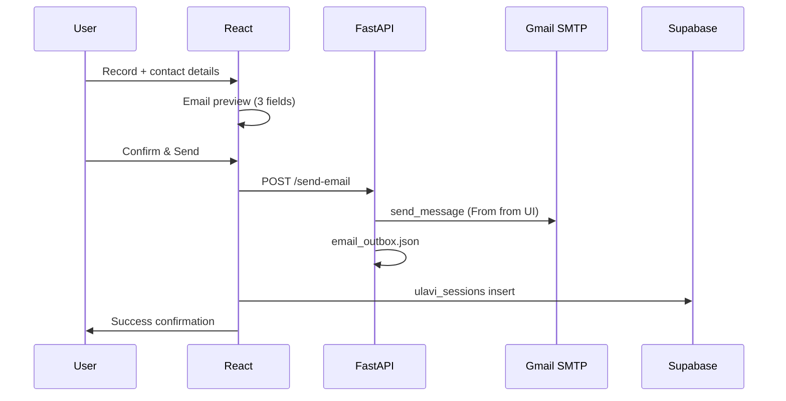

# Week 3 — Email & Test (Certification Checklist)

**Goal:** End-to-end flow works without errors; email received contains **Query**, **Phone Number**, and **Timestamp** correctly; tested with users from at least **2 country codes**.

---

## Deliverables status

| Requirement | Status | Where |
|-------------|--------|--------|
| Email body includes QUERY | Done | `backend/main.py` → `_build_email_body()` |
| Email body includes PHONE NUMBER | Done | Country code + number formatted |
| Email body includes TIMESTAMP | Done | ISO UTC from contact step |
| Confirmation screen after send | Done | `src/screens/Screen7Success.tsx` |
| Email preview before send | Done | `src/screens/Screen6EmailPreview.tsx` |
| Manual From address (UI) | Done | `src/screens/Screen5Contact.tsx` |
| Manual From address (API) | Done | `POST /send-email` → `from_email` |
| SMTP From default (backend) | Done | `SMTP_FROM` in `backend/.env` |
| Multi-country test script | Done | `backend/test_week3_email.py` (+91, +1) |
| Dashboard Sent/Inbox | Done | `src/screens/Screen8Dashboard.tsx` |

---

## How to complete certification (step by step)

### A. Configure Gmail SMTP

1. [Google Account → Security](https://myaccount.google.com/security) → 2-Step Verification ON
2. Create **App password** for Mail
3. Copy `backend/.env.example` → `backend/.env` and set:

```env
SMTP_HOST=smtp.gmail.com
SMTP_PORT=587
SMTP_USER=your-account@gmail.com
SMTP_PASSWORD=xxxx xxxx xxxx xxxx
SMTP_FROM=your-account@gmail.com
TEST_TO_EMAIL=support-or-test@gmail.com
```

4. Restart backend: `uvicorn main:app --reload`

### B. Automated API test (2 countries)

```powershell
cd backend
.\venv\Scripts\activate
python test_week3_email.py
```

Expected: both **India (+91)** and **United States (+1)** return `status: sent` or `queued`, and outbox body contains `QUERY:`, `PHONE NUMBER:`, `TIMESTAMP:`.

### C. Manual app test (real users)

1. `npm run dev` + backend running
2. **Test user 1 (India):** country **+91**, phone, your From Gmail, recipient To Gmail
3. **Test user 2 (US/UK):** country **+1** or **+44**, different phone
4. Record voice → Contact → **Preview Email** → **Confirm & Send Email**
5. Verify:
   - Success screen shows query, phone, timestamp
   - Recipient **Inbox** has all three fields
   - Sender **Sent** folder (if From matches Gmail account)
   - **Dashboard** → Sent / Inbox tabs

### D. Evidence for submission (screenshots)

Capture and attach:

1. Contact screen with **+91** and **+1** (or two different codes)
2. Email preview showing three fields
3. Success / confirmation screen with token
4. Received email in Gmail (body visible)
5. Dashboard with submission listed
6. Terminal output of `python test_week3_email.py` (optional)

---

## API reference (Week 3)

### `POST /send-email`

```json
{
  "from_email": "sender@gmail.com",
  "to_email": "support@gmail.com",
  "subject": "Voice Support Query",
  "query": "English transcript text",
  "phone_number": "9876543210",
  "country_code": "+91",
  "submitted_at": "2026-05-31T10:30:00.000Z",
  "original_text": "optional native text",
  "language": "Hindi"
}
```

### `GET /smtp-config`

Returns `configured`, `smtp_login`, `default_from_email`.

---

## Troubleshooting

| Issue | Fix |
|-------|-----|
| Email queued, not sent | Add SMTP vars to `backend/.env`, restart backend |
| SMTP 535 / auth failed | Regenerate App Password; no spaces in password |
| From rejected by Gmail | Use same address as `SMTP_USER` App Password account |
| Dashboard empty | Run Supabase migration; check `.env` Supabase keys |
| Backend not reachable | Start `uvicorn` from `backend/` with venv |

---

## Architecture (Week 3)



---

**Project:** ULAVI Technologies — Multilingual Voice Support  
**Week:** 3 — Email & Test
